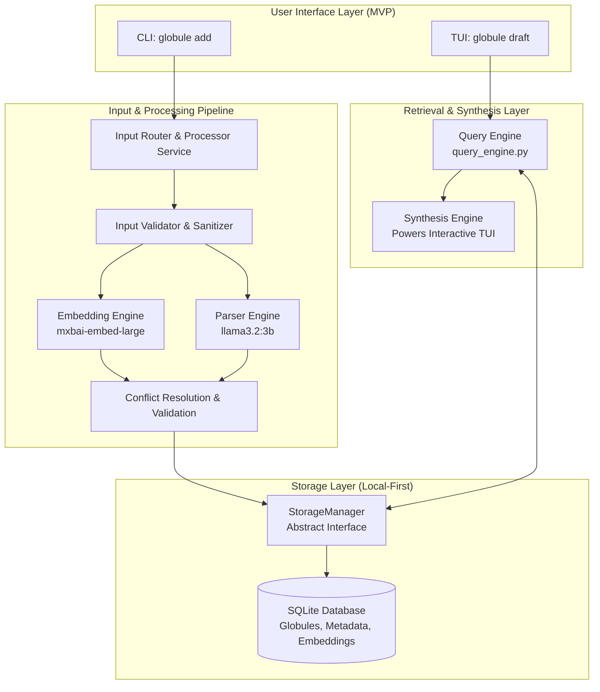

# Globule High Level Design Document

## 1. Executive Summary

Globule is a universal thought processor and knowledge management system that fundamentally reimagines how humans interact with computers. Unlike traditional note-taking applications that require manual organization, Globule employs an "AI Symbiosis" model where users focus purely on capture while AI handles all organizational complexity. The system is designed as a semantic layer that understands the meaning and connections between all user inputs, eventually evolving into a paradigm where computers understand context, not just commands.

The first product built on this semantic layer is a **collaborative drafting tool designed to prove the power of this new paradigm. It empowers creative writers and knowledge workers to synthesize raw, atomic thoughts into polished, structured documents through a unique, AI-assisted interactive workflow.**

## 2. Design Goals & Principles

This project is guided by a core set of principles that inform all architectural and product decisions.

- **Capture First, Organize Never**: The user experience must be optimized for frictionless capture of thoughts. As the project progresses past MVP/SLC, increasing automations of input types dramatically reduce friction of capture further. All organizational work, including file naming and directory structuring, happens automatically in the background through AI processing.
- **Semantic Understanding Over Hierarchical Storage**: Information is connected by its intrinsic meaning through embeddings and entity relationships, not by rigid, manually created folder structures. At the same time, properly integrating semantic and categorical understanding **into** the storage strategy produces an easily walkable knowledge base directory structure for humans and LLMs. You should be able to navigate the files without vector search and feel totally at ease. The main purpose of vector storage & search is the emergent connections.
- **AI as a Collaborative Partner, Not an Autocrat**: The system is designed for a human-in-the-loop workflow. The AI suggests, assists, enriches, and automates, but the user always remains in control of the final creative output.
- **Progressive Enhancement Architecture**: The MVP/SLC is designed to be simple but valuable, establishing a core architecture that can evolve into a full semantic OS layer without requiring disruptive rewrites in the future.
- **Privacy-First, Hybrid-by-Choice**: All user data and AI processing happens locally on the user's machine by default. Cloud-based features are offered as a transparent, secure, and explicit opt-in, allowing users to control their own data.
- **Modular and Pluggable Pipeline**: Every component, from input handlers to storage backends, is designed as an abstract interface with a concrete implementation. This allows for future extension and adaptation to new technologies and use cases without modifying the core system logic. At the same time, input schemas, parsing strategies, LLM temperatures and prompts, output schemas, etc. are all highly available for all users to edit, distribute and adapt to their best usage desires.

## 3. System Overview

Globule operates as a multi-stage processing pipeline that transforms chaotic, unstructured human input into structured, queryable knowledge. The system is composed of four primary layers: Input, Processing, Storage, and Synthesis.

1. **Input Layer**: Users interact with the system through various clients, with the initial MVP focusing on a Command-Line Interface (CLI) for capturing thoughts (`globule add`) and a Text-based User Interface (TUI) for drafting (`globule draft`).
2. **Processing Pipeline**: Every captured thought is processed asynchronously in the background. First, rapid but basic checking measures are applied to check for easily detectable schema types requiring further context. After/if the context is supplied, A dual-track pipeline simultaneously generates a semantic embedding vector and uses an LLM to parse for structured data like entities, categories, and sentiment. These two tracks are cross-validated to ensure a rich and accurate understanding of the input.
3. **Storage Layer**: The processed information is persisted locally. For the MVP, a single SQLite database is used to store both structured metadata (in standard columns and JSON fields) and the vector embeddings (in a BLOB field), providing a simple and portable solution. In this, we have a cute naming coincidence with the input "globule" being represented semantically as a group of BLOB fields. glob blob.
4. **Synthesis Engine**: This progresses towards the core of the user experience as more input types can become automated. The `SynthesisEngine` powers the interactive drafting table, fetching captured "globules" and providing AI-powered tools to help the user weave them into coherent, polished documents. The documents can be saved or shared.

## 4. System Architecture Diagram



## 5. Core Components in Detail

### 5.1. The Orchestration Engine

The Orchestration Engine is the conductor of the system, coordinating how different AI services work together to process and understand user input. Unlike traditional systems that might run embedding and parsing in isolation, the Orchestration Engine ensures these services inform and enhance each other's outputs.

**Key Responsibilities:**

- Coordinates the dual-track processing pipeline
- Makes intelligent decisions about how to combine insights from embedding and parsing
- Adapts its strategy based on content type and user corrections
- Maintains the balance between semantic understanding and structural analysis

**Implementation Details:**

```python
class OrchestrationEngine:
    """
    The conductor that ensures all AI services work in harmony
    """
    async def process_globule(self, text: str) -> ProcessedGlobule:
		# Rapid 'unintelligent' input detection
		schema_detected = await schemas(all).().trigger = true
		adaptive_input = schema_detected.actions(prompt_for_context)
		console.print(adaptive_input_verbosity, adaptive_input)

        # Initial semantic understanding
        initial_embedding = await self.embedder.embed(text)
        semantic_context = await self.find_semantic_neighbors(initial_embedding)

        # Informed parsing with semantic context
        parsing_prompt = self.build_context_aware_prompt(text, semantic_context)
        parsed_data = await self.llm.parse(parsing_prompt)

        # Refined embedding with parsed insights
        enriched_text = self.enrich_with_parsed_data(text, parsed_data)
        final_embedding = await self.embedder.embed(enriched_text)

        # Collaborative file organization decision
        file_decision = await self.collaborative_file_organizer(
            parsed_data, final_embedding, semantic_context
        )

        return ProcessedGlobule(
            text=text,
            embedding=final_embedding,
            parsed_data=parsed_data,
            file_path=file_decision.path,
            metadata=file_decision.metadata
        )
```

### 5.2. The Adaptive Input Module

The Adaptive Input Module serves as the conversational gateway into the system. It doesn't just accept text; it engages in a brief dialogue with the user when necessary to ensure mutual understanding.

**Key Features:**

- High-speed schema validation with user confirmation
- Configurable verbosity levels (automatic, concise, verbose)
- Schema detection and application
- Graceful handling of ambiguous inputs

**Conversational Contract Example:**

```
$ globule add "you are a ux design specialist, please review the following mockup and critique it with enthusiasm"

> It appears this input is a prompt
[Press Enter to confirm, 'n' to correct, or wait 3 seconds for auto-confirm]
```

**Schema Support:** The Input Module ships with basic schemas and allows user-defined schemas:

```yaml
schemas:
  link_curation:
    trigger:
      contains: ["http://", "https://", "www."]
    actions:
      - fetch_title
      - extract_description
      - prompt_for_context: "Why save this link?"
    output:
      format: "[{title}]({url})\n{user_context}"
```

### 5.3. The Dual Intelligence Services

The system employs two complementary AI services that work together rather than in competition:

#### 5.3.1. Semantic Embedding Service

- **Purpose**: Captures the gestalt - overall meaning, feeling, and relationships
- **Technology**: `mxbai-embed-large` via Ollama (local or huggingface API) or similar
- **Output**: High-dimensional vectors representing semantic meaning
- **Strengths**: Understanding context, finding related concepts, emotional tone

#### 5.3.2. Structural Parsing Service

- **Purpose**: Extracts specific entities, facts, and structured data
- **Technology**: `llama3.2:3b` via Ollama (local or huggingface API) or similar
- **Output**: JSON structured data with entities, categories, sentiment
- **Strengths**: Identifying concrete details, temporal markers, named entities

**Collaborative Processing:**

```python
class CollaborativeProcessor:
    def determine_weights(self, content_profile):
        """
        Dynamically adjusts how much to rely on each service
        based on content type
        """
        if content_profile.structure_score > 0.8:
            # Highly structured content (meeting notes, forms)
            return {"parsing": 0.7, "embedding": 0.3}
        elif content_profile.creativity_score > 0.7:
            # Creative or philosophical content
            return {"parsing": 0.3, "embedding": 0.7}
        else:
            # Balanced approach for most content
            return {"parsing": 0.5, "embedding": 0.5}
```

### 5.4. The Intelligent Storage Manager

This component revolutionizes how information is stored by making the filesystem itself a semantic index.

**Key Innovations:**

- Automatic generation of meaningful directory structures
- Semantic file naming without redundancy
- Metadata preservation using OS capabilities
- Cross-platform compatibility

**File Organization Logic:**

```python
class SemanticFileOrganizer:
    async def organize(self, globule):
        # Use embeddings to find semantic neighborhood
        directory = await self.determine_semantic_directory(
            globule.embedding,
            existing_structure=await self.scan_directories()
        )

        # Use parsing for specific, meaningful filename
        filename = self.craft_filename(
            entities=globule.parsed_data.entities,
            theme=globule.parsed_data.theme,
            avoid_redundancy_with=directory
        )

        # Example output:
        # ~/globule/creative-writing/fantasy-novel/characters/andromeda-heros-journey.md
        # Directory provides context, filename provides specifics
        # Date not in filename since OS tracks creation/modification
```

**Metadata Strategy:**

```python
class MetadataAwareStorage:
    def store_rich_metadata(self, file_path, globule):
        # OS-level metadata (dates handled by filesystem)

        # Extended attributes for Unix-like systems
        if supports_xattr():
            xattr.setxattr(file_path, 'user.globule.embedding',
                          globule.embedding.tobytes())

        # Cross-platform companion file
        metadata_path = f"{file_path}.globule"
        metadata = {
            'embedding': globule.embedding.tolist(),
            'parsed_data': globule.parsed_data,
            'semantic_neighbors': globule.context_ids,
            'confidence_scores': globule.confidence
        }
        save_json(metadata_path, metadata)
```

### 5.5. The Interactive Synthesis Engine

The Synthesis Engine powers the `globule draft` experience, transforming scattered thoughts into coherent documents through an intelligent, discovery-oriented interface.

**Core Components:**

#### 5.5.1. The Palette (Left Pane)

- **Default View**: Semantically clustered thoughts for manageable overview. Can be configured in relationship with the content queried and/or initial `globule draft <query vector`, such as a daily journal output schema sorting palette temporally, or a philosophical ramble sorting by semantically clustered thoughts
- **Progressive Loading**: Initially shows requested timeframe, secretly pre-loads related content
- **Alternative Views**: Chronological list, tag-based grouping
- **Keyboard Navigation**: Arrow keys for browsing, Enter to add, Tab to explore

#### 5.5.2. The Canvas (Right Pane)

- **Solving Blank Canvas**: Auto-generates suggested title or opening based on dominant themes. Further extension could mean output schema loading based on palette content & intial `globule draft <query vector>`
- **AI Co-pilot Actions**: Expand, summarize, rephrase selected text
- **Real-time Collaboration**: AI suggestions appear as user types
- **Export Options**: Markdown, HTML, PDF

#### 5.5.3. Progressive Discovery Implementation

```python
class ProgressiveDiscoveryEngine:
    """
    Like dropping a stone in a pond - ripples of relevance
    spread outward as the user explores
    """

    async def initialize_palette(self, time_context):
        # Start with the obvious - recent notes
        immediate_notes = await self.fetch_temporal(time_context)

        # Group them semantically for manageable presentation
        clusters = self.cluster_by_embedding(immediate_notes)

        # But secretly, start warming up the semantic cache
        self.background_task = asyncio.create_task(
            self._expand_semantic_horizons(immediate_notes)
        )

        return clusters

    async def on_user_focus(self, selected_globule):
        """
        When user hovers or selects, the ripples expand
        """
        # Immediate response - show what we've already found
        if cached_relatives := self.semantic_cache.get(selected_globule.id):
            yield cached_relatives[:3]  # Don't overwhelm

        # Then dig deeper
        deep_connections = await self.find_deep_connections(
            selected_globule,
            max_hops=2,  # Connections of connections
            min_similarity=0.6
        )

        # Present them as "ghosts" - semi-transparent suggestions
        # that don't distract from the main task
        yield deep_connections
```

### 5.6. The Configuration Cascade

The system operates on a three-tier configuration model that ensures both simplicity for beginners and power for advanced users:

```yaml
# Tier 1: System Defaults (rarely changed)
system:
  defaults:
    processing_transparency: "concise"
    file_organization: "semantic"
    ai_model_embedding: "mxbai-embed-large"
    ai_model_parsing: "llama3.2:3b"

# Tier 2: User Preferences (personal defaults)
user:
  preferences:
    processing_transparency: "verbose"
    theme: "dark"
    synthesis:
      default_cluster_view: true
      ai_suggestions_aggression: "moderate"

# Tier 3: Context Overrides (project/mode specific)
contexts:
  creative_writing:
    processing_transparency: "verbose"
    synthesis:
      ai_suggestions_aggression: "proactive"
      show_semantic_connections: true
  work_notes:
    processing_transparency: "silent"
    file_organization:
      prefer_chronological: true
```

### 5.7. The Schema Definition Engine

Schemas transform Globule from a generic tool into a personalized knowledge workflow system:

```yaml
# Example: Complete Valet Service Schema
schemas:
  valet_daily:
    input_patterns:
      car_arrival:
        triggers: ["license plate", "parked", "arrived"]
        capture:
          - license_plate: required
          - make_model: optional
          - time_in: auto_timestamp
          - location: optional

      car_departure:
        triggers: ["picked up", "left", "departed"]
        capture:
          - license_plate: required
          - time_out: auto_timestamp
          - fee: number
          - tip: number

    processing:
      auto_correlate:
        - match: car_arrival.license_plate = car_departure.license_plate
        - calculate: duration = time_out - time_in

    daily_synthesis:
      trigger: "end_of_shift"
      generate:
        - total_cars: count(car_arrival)
        - revenue: sum(car_departure.fee)
        - tips: sum(car_departure.tip)
        - average_duration: avg(duration)
        - incidents: filter(type="incident")
      output:
        format: "dashboard"
        template: "valet_daily_report.html"
```

## 6. Data Flow Scenarios

### 6.1. Primary User Journey: Creative Drafting

This scenario details the end-to-end workflow for the creative writing use case, which is the primary focus of the MVP.

1. **Capture Phase (Throughout the Day)**: The writer captures several thoughts using the CLI.

   - `globule add "The concept of 'progressive overload' in fitness could apply to creative stamina."`
   - `globule add "Thinking about my morning routine and how it sets the tone for the day."`
   - `globule add "A core theme for my next post: discipline isn't about restriction, it's about freedom."`
   - _Backend Action_: For each command, the `Processor` service immediately saves the raw text and spawns a background task. The task generates a vector embedding, parses the text for entities and topics (e.g., "creativity," "discipline"), and stores the fully processed globule in the SQLite database.

2. **Synthesis Phase (`globule draft`)**: The next morning, the writer initiates the drafting process.

   - _Backend Action_: The `QueryEngine` is invoked. It fetches all globules from the specified timeframe ("yesterday"), clusters them by semantic similarity using their embeddings, and passes the grouped data to the `SynthesisEngine`.

3. **Interactive Drafting in the TUI**:

   - The `SynthesisEngine` launches the two-pane Textual TUI.
   - **The Palette (Left Pane)**: Displays the captured globules, already grouped into clusters like "Creative Process" and "Daily Routine" to provide immediate, manageable structure.
   - **The Canvas (Right Pane)**: To overcome the "blank canvas" problem, the AI provides a suggested title based on the most prominent theme: `Draft Title: On Building Creative Stamina`.
   - The user selects thoughts from the Palette, which are appended to the Canvas. They edit the text, weaving the raw notes together.

4. **Discovery & Enrichment ("Explore Mode")**:

   - The user highlights the "morning routine" globule in the Palette and presses `Tab`.
   - _Backend Action_: This triggers a new request to the `QueryEngine`. It performs a semantic search against the _entire_ database using the "morning routine" globule's embedding as the query vector.
   - The Palette view is temporarily replaced with the search results, showing older notes about habits and productivity. The user selects one and adds it to their draft.

5. **Finalization and Intelligent Saving**:

   - The user saves the completed draft.
   - _Backend Action_: The `StorageManager` receives the final text. It runs a light version of the parsing pipeline on the text to determine key themes ("productivity," "creativity") and suggests a filename and path: `/blog-posts/productivity/2025-07-09_the-progressive-overload-of-the-soul.md`. The file is then saved to the local disk.

## 7. Key Technical Decisions

### 7.1. Handling Semantic-Parsing Disagreements

When embedding and parsing provide conflicting signals (such as detecting sarcasm), the system preserves both interpretations:

```python
class NuanceDetector:
    def handle_disagreement(self, literal_sentiment, semantic_sentiment):
        if abs(literal_sentiment - semantic_sentiment) > 0.5:
            return {
                "nuance_detected": True,
                "confidence": "low",
                "preserve_both": True,
                "flag_for_review": True
            }
```

### 7.2. Transparency Suite Implementation

Every AI decision is inspectable and correctable:

```
$ globule add "Another brilliant meeting. Just what my day needed."

> Processing detected:
  Literal: Positive sentiment (words: "brilliant", "needed")
  Semantic: Frustration cluster (0.87 similarity)
  Possible sarcasm detected

  Suggested: ~/globule/work/frustrations/meeting-overload.md

[Enter to accept, 'e' to edit, 'f' to fix classification]
```

### 7.3. Scaling Strategy

For the MVP, performance is ensured through:

- Semantic search on cached recent vectors (< 500ms response time)
- Background pre-loading of likely connections
- Hierarchical indexing in the filesystem itself
- Asynchronous processing to never block the UI

## 8. Integration Considerations

### 8.1. Obsidian Compatibility

- Globule outputs standard Markdown files
- Directory structures are browsable in any file manager
- Metadata stored in companion `.globule` files to avoid conflicts
- Potential for future Obsidian plugin for tighter integration

### 8.2. Cross-Platform Support

- SQLite for universal database support
- Companion metadata files for systems without extended attributes
- Standard Markdown output for maximum compatibility
- Local-first architecture with optional cloud sync

## 9. Performance & Scalability

- **Expected Load (MVP)**: The system is designed for a single user, handling hundreds of new globules per day and a total database size of tens of thousands of entries.
- **Bottleneck Mitigation**:
  - **UI Responsiveness**: The primary concern is ensuring the TUI never freezes. All AI and database operations are executed in background tasks via `asyncio` and `ProcessPoolExecutor`, keeping the main UI thread free.
  - **Query Speed**: For the MVP, semantic search queries will be performed against a cached subset of recent vectors to guarantee sub-second response times in "Explore Mode." Full database scans will be a secondary, asynchronous option.
- **Future Scaling Strategy**: The abstract `StorageManager` is the key to future scalability. As the database grows, the SQLite backend can be swapped for a production-grade PostgreSQL database and a dedicated vector store like FAISS or Milvus without altering the core application logic.

## 10. Security & Compliance

- **Data Protection**: As a local-first application, data security is paramount. The SQLite database can be encrypted at rest using extensions like `sqlcipher`. All files are stored on the local filesystem under the user's control.
- **API Security**: The MVP does not expose a network-facing API. When APIs are introduced in future stages for cloud sync, they will use industry-standard JWT-based authentication and will be subject to rate limiting and input sanitization to prevent abuse.
- **Prompt Injection**: All user input passed to internal or external LLMs will be sanitized to mitigate the risk of prompt injection attacks.

## 11. Open Architectural Decisions (Post-MVP)

While the MVP architecture is clearly defined, several decisions remain open for future stages. These are explicitly out of scope for the "Ollie" MVP but are documented here for future consideration.

- **Real-time Collaboration Protocol**: A choice between CRDTs (Conflict-free Replicated Data Types) and Operational Transformation (OT) will be necessary for multi-user editing features.
- **Plugin Sandboxing Mechanism**: To support a secure third-party plugin ecosystem, a sandboxing technology (e.g., WebAssembly) will need to be implemented.
- **Graph Database Selection**: For Stage 3, when explicit relationships become a core feature, a formal evaluation of graph databases (e.g., Neo4j, ArangoDB) will be required.

---

This High Level Design Document represents the complete architectural vision for Globule as refined through our conversation. It transforms the initial concept of a note-taking application into a revolutionary paradigm for human-computer collaboration, where semantic understanding and intelligent organization create a new way of thinking with machines. Each component has been designed to work both independently and as part of a greater whole, ensuring that the system can grow from a simple MVP into the full vision of a semantic OS layer without fundamental restructuring.