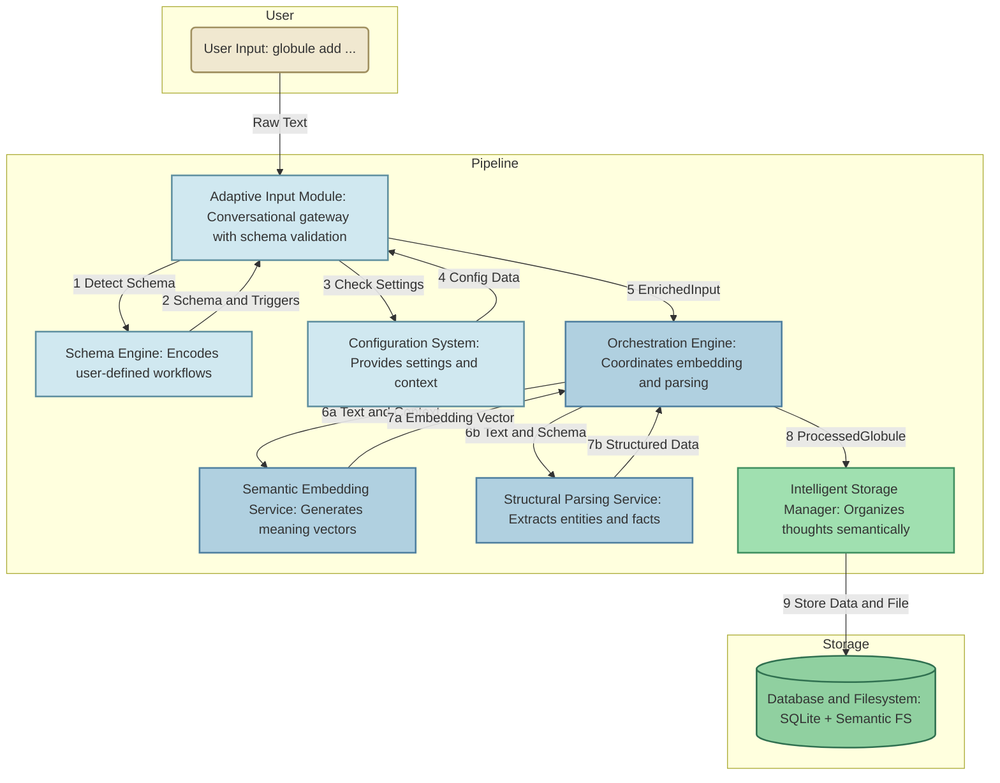
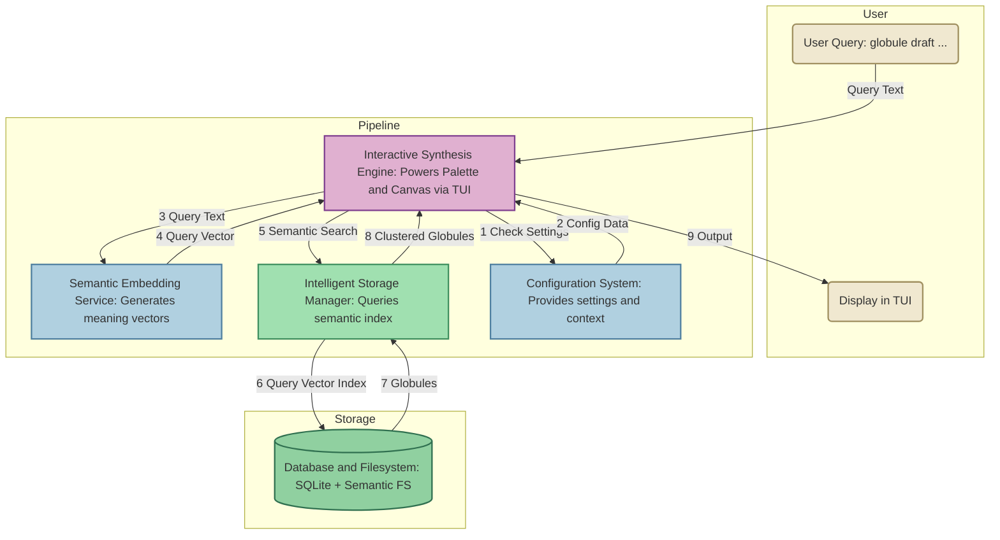

# Component Interaction Flows

_Version: 1.5_  
_Status: Draft_

This document describes how Globule’s core components interact during primary user flows, complementing the static architecture in `HLD.txt`, `21_Technical-Architecture.md`, and `architectural-philosophy_component-narrative.txt`.
## Flow 1: The Ingestion Pipeline

Triggered when a user adds a new globule (e.g., `globule add "Note to self: research CRDTs for the real-time collaboration feature."`). See `HLD.txt` Section 6.1.

**Step 1: Entry and Initial Validation**

- **Component:** `Adaptive Input Module` (`input_adapter.py`)
- **Input:** Raw text via CLI.
- **Action:**
  • Consults `Schema Engine` to detect input type (`22_Component-Shopping-List.md` Section 8).
  • Queries `Configuration System` for settings (e.g., verbosity; `20_High-Level-Design.md` Section 5.6).
  • Applies `free_text` schema if no specific triggers match, optionally prompting for context.
- **Output:** `EnrichedInput` object passed to `Orchestration Engine`.

**Step 2: The Conductor Orchestrates Intelligence**

- **Component:** `Orchestration Engine` (`orchestration.py`)
- **Input:** `EnrichedInput` object.
- **Action:**
  • Runs parallel tasks:
    - `Semantic Embedding Service` generates vector embedding (`mxbai-embed-large`; `21_Technical-Architecture.md` Section 5.3.1).
    - `Structural Parsing Service` extracts entities and metadata (`llama3.2:3b`; `21_Technical-Architecture.md` Section 5.3.2).
  • Resolves disagreements (e.g., sarcasm; `HLD.txt` Section 7.1).
- **Output:** `ProcessedGlobule` object.

**Step 3: Intelligent Persistence**

- **Component:** `Intelligent Storage Manager` (`storage_manager.py`)
- **Input:** `ProcessedGlobule` object.
- **Action:**
  • Stores data in SQLite database (`22_Component-Shopping-List.md` Section 5).
  • Generates semantic path (e.g., `.../technical-research/crdt-real-time-collaboration.md`) and saves as Markdown with metadata (`architectural-philosophy_component-narrative.txt`).
- **Output:** Stored and indexed thought.

## Flow 2: The Synthesis and Retrieval Flow

Triggered when a user creates a document (e.g., `globule draft "real-time features"`). See `HLD.txt` Section 6.1.

**Step 1: Query and Retrieval**

- **Component:** `Interactive Synthesis Engine` (`synthesis_engine.py`)
- **Input:** Query string (e.g., “real-time features”).
- **Action:**
  • Queries `Configuration System` for Palette settings (`20_High-Level-Design.md` Section 5.6).
  • Calls `Semantic Embedding Service` for query vector (`21_Technical-Architecture.md` Section 5.3.1).
  • Passes vector to `Intelligent Storage Manager` for semantic search.
- **Output:** List of `Globule` objects.

**Step 2: Display and Interaction**

- **Component:** `Interactive Synthesis Engine`
- **Input:** `Globule` objects.
- **Action:**
  • Clusters globules for Palette pane (`architectural-philosophy_component-narrative.txt`).
  • Displays TUI with Palette and Canvas (`HLD.txt` Section 5.5).
  • Supports “Explore Mode” via repeated semantic searches (`21_Technical-Architecture.md` Section 5.5.3).
- **Output:** Polished document displayed in TUI.

## Supporting Roles of Foundational Components

- `Configuration System`: Provides settings for all components (`22_Component-Shopping-List.md` Section 7).
- `Schema Engine`: Validates inputs and builds prompts for `Adaptive Input Module` and `Structural Parsing Service` (`22_Component-Shopping-List.md` Section 8).

