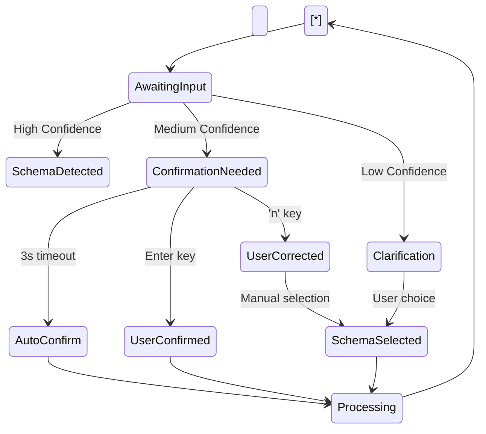
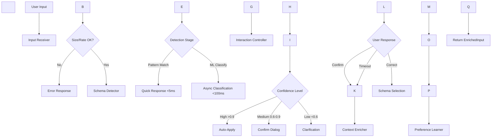

\# Adaptive Input Module - Low Level Design


\*\*Version:\*\* 1.0  

\*\*Date:\*\* 2025-01-17  

\*\*Status:\*\* Draft for Review


\## 1. Purpose and Scope


The Adaptive Input Module (AIM) serves as the conversational gateway into the Globule system, transforming raw user input into enriched, schema-aware data ready for processing. It operates as the first touchpoint for users, providing intelligent input validation, schema detection, and contextual enrichment while maintaining a friction-free capture experience.


\### Boundaries

\- \*\*In Scope:\*\*

&nbsp; - Text input processing and validation

&nbsp; - Schema detection and application

&nbsp; - User interaction and confirmation flows

&nbsp; - Context gathering for ambiguous inputs

&nbsp; - Configuration-based behavior adaptation

&nbsp; 

\- \*\*Out of Scope:\*\*

&nbsp; - Actual content processing (handled by Orchestration Engine)

&nbsp; - Schema definition (handled by Schema Engine)

&nbsp; - Storage operations (handled by Storage Manager)

&nbsp; - Non-text inputs in MVP (future enhancement)


\## 2. Functional Overview


The module provides three core behaviors:


1\. \*\*Conversational Validation\*\*: Engages users in brief dialogues when input intent is unclear, using a 3-second auto-confirmation mechanism with manual override options.


2\. \*\*Intelligent Schema Detection\*\*: Automatically identifies input types through pattern matching and confidence scoring, applying appropriate schemas for structured processing.


3\. \*\*Adaptive Behavior\*\*: Adjusts interaction style based on user preferences, context, and historical patterns, supporting multiple verbosity levels from silent to debug mode.


\### Key Guarantees

\- Response time under 100ms for user feedback

\- Schema detection accuracy above 90% for common patterns

\- Zero data loss during input processing

\- Graceful degradation when schemas unavailable


\## 3. External Interfaces


\### 3.1 Input Interface

```python

class AdaptiveInputModule:

&nbsp;   async def process\_input(

&nbsp;       self,

&nbsp;       text: str,

&nbsp;       context: Optional\[Dict\[str, Any]] = None,

&nbsp;       override\_schema: Optional\[str] = None

&nbsp;   ) -> EnrichedInput:

&nbsp;       """

&nbsp;       Process raw text input and return enriched data.

&nbsp;       

&nbsp;       Args:

&nbsp;           text: Raw user input

&nbsp;           context: Optional context (e.g., clipboard content, previous input)

&nbsp;           override\_schema: Force specific schema application

&nbsp;           

&nbsp;       Returns:

&nbsp;           EnrichedInput with detected schema and gathered context

&nbsp;       """

```


\### 3.2 Data Contracts

```python

@dataclass

class EnrichedInput:

&nbsp;   original\_text: str

&nbsp;   enriched\_text: str

&nbsp;   detected\_schema\_id: Optional\[str]

&nbsp;   confidence\_score: float

&nbsp;   additional\_context: Dict\[str, Any]

&nbsp;   user\_corrections: List\[str]

&nbsp;   timestamp: datetime

&nbsp;   

@dataclass

class SchemaMatch:

&nbsp;   schema\_id: str

&nbsp;   confidence: float

&nbsp;   matched\_patterns: List\[str]

&nbsp;   reason: str  # 'pattern\_match', 'ml\_classification', 'user\_override'

```


\### 3.3 Integration Points

\- \*\*Schema Engine\*\*: Query available schemas, validate against definitions

\- \*\*Configuration System\*\*: Retrieve user preferences and context settings

\- \*\*Orchestration Engine\*\*: Pass enriched input for processing

\- \*\*Event Bus\*\* (future): Emit schema detection events for analytics


\## 4. Internal Design


\### 4.1 Input Receiver

\*\*Purpose\*\*: Entry point for all user input, handling rate limiting and initial validation.


\*\*Internal Structure\*\*:

```python

class InputReceiver:

&nbsp;   def \_\_init\_\_(self):

&nbsp;       self.rate\_limiter = TokenBucket(10, 1)  # 10 tokens/sec

&nbsp;       self.input\_queue = asyncio.Queue(maxsize=100)

&nbsp;       self.size\_limit = 10\_000  # characters

&nbsp;       

&nbsp;   async def receive(self, raw\_input: str) -> str:

&nbsp;       # Size validation

&nbsp;       if len(raw\_input) > self.size\_limit:

&nbsp;           raise InputTooLargeError(f"Max {self.size\_limit} chars")

&nbsp;           

&nbsp;       # Rate limiting

&nbsp;       if not self.rate\_limiter.consume():

&nbsp;           raise RateLimitExceededError()

&nbsp;           

&nbsp;       # Basic sanitization

&nbsp;       sanitized = self.\_sanitize(raw\_input)

&nbsp;       await self.input\_queue.put(sanitized)

&nbsp;       return sanitized

```


\*\*Communication\*\*: Pushes validated input to Schema Detector via internal queue.


\*\*Edge Handling\*\*: 

\- Truncates oversized inputs with warning

\- Queues inputs during rate limit with backpressure

\- Strips control characters and normalizes whitespace


\### 4.2 Schema Detector

\*\*Purpose\*\*: Identifies applicable schemas through multi-stage detection pipeline.


\*\*Internal Logic\*\*:

```python

class SchemaDetector:

&nbsp;   def \_\_init\_\_(self):

&nbsp;       self.pattern\_matcher = PatternMatcher()

&nbsp;       self.ml\_classifier = None  # Lazy loaded

&nbsp;       self.cache = LRUCache(maxsize=1000)

&nbsp;       

&nbsp;   async def detect(self, text: str, hint: Optional\[str] = None) -> SchemaMatch:

&nbsp;       # Check cache first

&nbsp;       cache\_key = hash(text + str(hint))

&nbsp;       if cached := self.cache.get(cache\_key):

&nbsp;           return cached

&nbsp;           

&nbsp;       # Stage 1: Explicit hint (highest priority)

&nbsp;       if hint:

&nbsp;           return SchemaMatch(hint, 1.0, \[], 'user\_override')

&nbsp;           

&nbsp;       # Stage 2: Pattern matching (<5ms)

&nbsp;       if pattern\_match := self.pattern\_matcher.match(text):

&nbsp;           if pattern\_match.confidence > 0.9:

&nbsp;               result = SchemaMatch(

&nbsp;                   pattern\_match.schema\_id,

&nbsp;                   pattern\_match.confidence,

&nbsp;                   pattern\_match.patterns,

&nbsp;                   'pattern\_match'

&nbsp;               )

&nbsp;               self.cache.put(cache\_key, result)

&nbsp;               return result

&nbsp;               

&nbsp;       # Stage 3: ML classification (async, <100ms)

&nbsp;       if self.ml\_classifier and len(text) > 50:

&nbsp;           prediction = await self.\_ml\_classify(text)

&nbsp;           if prediction.confidence > 0.7:

&nbsp;               result = SchemaMatch(

&nbsp;                   prediction.schema\_id,

&nbsp;                   prediction.confidence,

&nbsp;                   \[],

&nbsp;                   'ml\_classification'

&nbsp;               )

&nbsp;               self.cache.put(cache\_key, result)

&nbsp;               return result

&nbsp;               

&nbsp;       # Default fallback

&nbsp;       return SchemaMatch('free\_text', 0.5, \[], 'default')

```


\*\*Pattern Matching Strategy\*\*:

```python

class PatternMatcher:

&nbsp;   patterns = {

&nbsp;       'link\_curation': \[

&nbsp;           (r'^https?://', 0.95),

&nbsp;           (r'^www\\.', 0.85),

&nbsp;           (r'\\.(com|org|net|io)', 0.7)

&nbsp;       ],

&nbsp;       'task\_entry': \[

&nbsp;           (r'^(todo|task):', 0.95),

&nbsp;           (r'^- \\\[ \\]', 0.9),

&nbsp;           (r'(remind me|due|deadline)', 0.8)

&nbsp;       ],

&nbsp;       'prompt': \[

&nbsp;           (r'^(you are|act as|please)', 0.85),

&nbsp;           (r'(explain|analyze|summarize|review)', 0.8)

&nbsp;       ]

&nbsp;   }

```


\### 4.3 Interaction Controller

\*\*Purpose\*\*: Manages user dialogue flow and confirmation mechanisms.


\*\*State Machine\*\*:




\*\*Implementation\*\*:

```python

class InteractionController:

&nbsp;   def \_\_init\_\_(self, config: InteractionConfig):

&nbsp;       self.auto\_confirm\_delay = config.auto\_confirm\_delay  # 3s default

&nbsp;       self.verbosity = config.verbosity\_level

&nbsp;       self.state = InteractionState.AWAITING\_INPUT

&nbsp;       

&nbsp;   async def handle\_detection(self, match: SchemaMatch) -> ConfirmationResult:

&nbsp;       if match.confidence > 0.9:

&nbsp;           # High confidence - apply immediately

&nbsp;           return ConfirmationResult(accepted=True, schema\_id=match.schema\_id)

&nbsp;           

&nbsp;       elif match.confidence > 0.6:

&nbsp;           # Medium confidence - confirm with user

&nbsp;           prompt = self.\_format\_confirmation(match)

&nbsp;           return await self.\_confirm\_with\_timeout(prompt, match)

&nbsp;           

&nbsp;       else:

&nbsp;           # Low confidence - request clarification

&nbsp;           options = await self.\_get\_schema\_options()

&nbsp;           return await self.\_clarify\_with\_user(options)

&nbsp;           

&nbsp;   async def \_confirm\_with\_timeout(self, prompt: str, match: SchemaMatch):

&nbsp;       print(prompt)

&nbsp;       

&nbsp;       # Start countdown

&nbsp;       start\_time = time.time()

&nbsp;       while time.time() - start\_time < self.auto\_confirm\_delay:

&nbsp;           if user\_input := self.\_check\_input():

&nbsp;               if user\_input == '\\n':

&nbsp;                   return ConfirmationResult(True, match.schema\_id)

&nbsp;               elif user\_input == 'n':

&nbsp;                   return await self.\_handle\_correction(match)

&nbsp;                   

&nbsp;           # Show countdown progress

&nbsp;           remaining = self.auto\_confirm\_delay - (time.time() - start\_time)

&nbsp;           self.\_update\_countdown(remaining)

&nbsp;           await asyncio.sleep(0.1)

&nbsp;           

&nbsp;       # Auto-confirm after timeout

&nbsp;       return ConfirmationResult(True, match.schema\_id)

```


\### 4.4 Context Enricher

\*\*Purpose\*\*: Gathers additional context based on detected schema requirements.


\*\*Context Gathering\*\*:

```python

class ContextEnricher:

&nbsp;   async def enrich(self, text: str, schema: Schema) -> Dict\[str, Any]:

&nbsp;       context = {

&nbsp;           'timestamp': datetime.now(),

&nbsp;           'input\_length': len(text),

&nbsp;           'source': 'cli'

&nbsp;       }

&nbsp;       

&nbsp;       # Schema-specific enrichment

&nbsp;       for action in schema.actions:

&nbsp;           if action.type == 'fetch\_title' and 'url' in text:

&nbsp;               context\['page\_title'] = await self.\_fetch\_url\_title(text)

&nbsp;               

&nbsp;           elif action.type == 'prompt\_context':

&nbsp;               response = await self.\_prompt\_user(action.prompt)

&nbsp;               context\[action.field] = response

&nbsp;               

&nbsp;           elif action.type == 'extract\_metadata':

&nbsp;               context\['metadata'] = self.\_extract\_metadata(text)

&nbsp;               

&nbsp;       return context

```


\### 4.5 Preference Learner

\*\*Purpose\*\*: Tracks user corrections and adapts future behavior.


\*\*Learning Mechanism\*\*:

```python

class PreferenceLearner:

&nbsp;   def \_\_init\_\_(self):

&nbsp;       self.correction\_history = deque(maxlen=1000)

&nbsp;       self.schema\_scores = defaultdict(lambda: {'correct': 0, 'total': 0})

&nbsp;       

&nbsp;   def record\_correction(self, original: SchemaMatch, corrected: str):

&nbsp;       self.correction\_history.append({

&nbsp;           'original': original,

&nbsp;           'corrected': corrected,

&nbsp;           'timestamp': time.time()

&nbsp;       })

&nbsp;       

&nbsp;       # Update scoring

&nbsp;       self.schema\_scores\[original.schema\_id]\['total'] += 1

&nbsp;       if corrected != original.schema\_id:

&nbsp;           self.schema\_scores\[original.schema\_id]\['correct'] += 0

&nbsp;       else:

&nbsp;           self.schema\_scores\[original.schema\_id]\['correct'] += 1

&nbsp;           

&nbsp;   def get\_confidence\_adjustment(self, schema\_id: str) -> float:

&nbsp;       scores = self.schema\_scores\[schema\_id]

&nbsp;       if scores\['total'] < 10:

&nbsp;           return 0.0  # Not enough data

&nbsp;           

&nbsp;       accuracy = scores\['correct'] / scores\['total']

&nbsp;       # Boost confidence for high-accuracy schemas

&nbsp;       if accuracy > 0.9:

&nbsp;           return 0.1

&nbsp;       # Reduce confidence for frequently corrected schemas

&nbsp;       elif accuracy < 0.5:

&nbsp;           return -0.2

&nbsp;       return 0.0

```


\## 5. Control Flow and Data Flow


\### Primary Flow: Input Processing Pipeline




\### Asynchronous Processing Flow

```python

async def process\_input\_pipeline(self, raw\_input: str):

&nbsp;   # Stage 1: Receive and validate (sync, <1ms)

&nbsp;   validated = await self.receiver.receive(raw\_input)

&nbsp;   

&nbsp;   # Stage 2: Detect schema (async, <5ms typical)

&nbsp;   detection\_task = asyncio.create\_task(

&nbsp;       self.detector.detect(validated)

&nbsp;   )

&nbsp;   

&nbsp;   # Stage 3: Prepare UI while detecting

&nbsp;   ui\_task = asyncio.create\_task(

&nbsp;       self.controller.prepare\_interface()

&nbsp;   )

&nbsp;   

&nbsp;   # Wait for detection

&nbsp;   match = await detection\_task

&nbsp;   await ui\_task

&nbsp;   

&nbsp;   # Stage 4: User interaction (async, variable)

&nbsp;   confirmation = await self.controller.handle\_detection(match)

&nbsp;   

&nbsp;   # Stage 5: Enrich context (async, <50ms)

&nbsp;   if confirmation.accepted:

&nbsp;       schema = await self.schema\_engine.get\_schema(confirmation.schema\_id)

&nbsp;       context = await self.enricher.enrich(validated, schema)

&nbsp;       

&nbsp;       # Stage 6: Learn from interaction

&nbsp;       self.learner.record\_interaction(match, confirmation)

&nbsp;       

&nbsp;       return EnrichedInput(

&nbsp;           original\_text=raw\_input,

&nbsp;           enriched\_text=validated,

&nbsp;           detected\_schema\_id=confirmation.schema\_id,

&nbsp;           confidence\_score=match.confidence,

&nbsp;           additional\_context=context,

&nbsp;           user\_corrections=confirmation.corrections

&nbsp;       )

```


\## 6. Configuration and Tuning


\### Configuration Schema

```yaml

adaptive\_input:

&nbsp; # Interaction settings

&nbsp; interaction:

&nbsp;   auto\_confirm\_delay: 3.0  # seconds

&nbsp;   verbosity\_level: "concise"  # silent|concise|verbose|debug

&nbsp;   show\_countdown: true

&nbsp;   use\_colors: true

&nbsp;   

&nbsp; # Detection settings  

&nbsp; detection:

&nbsp;   pattern\_confidence\_threshold: 0.9

&nbsp;   ml\_confidence\_threshold: 0.7

&nbsp;   enable\_ml\_classification: false  # Disabled by default for performance

&nbsp;   cache\_size: 1000

&nbsp;   

&nbsp; # Rate limiting

&nbsp; rate\_limiting:

&nbsp;   tokens\_per\_second: 10

&nbsp;   burst\_size: 20

&nbsp;   

&nbsp; # Input validation

&nbsp; validation:

&nbsp;   max\_input\_size: 10000  # characters

&nbsp;   allowed\_characters: "printable"  # printable|extended|all

&nbsp;   strip\_control\_chars: true

&nbsp;   

&nbsp; # Learning preferences

&nbsp; learning:

&nbsp;   enable\_preference\_learning: true

&nbsp;   history\_size: 1000

&nbsp;   min\_samples\_for\_adjustment: 10

&nbsp;   

&nbsp; # Schema-specific overrides

&nbsp; schema\_overrides:

&nbsp;   link\_curation:

&nbsp;     auto\_confirm\_delay: 1.0  # Faster for URLs

&nbsp;     always\_fetch\_title: true

&nbsp;   task\_entry:

&nbsp;     verbosity\_level: "verbose"  # More detail for tasks

```


\### Runtime Tuning

```python

class ConfigManager:

&nbsp;   def apply\_context\_override(self, base\_config: Config, context: str) -> Config:

&nbsp;       """Apply context-specific configuration overrides"""

&nbsp;       if context == "batch\_processing":

&nbsp;           base\_config.interaction.auto\_confirm\_delay = 0  # No delays

&nbsp;           base\_config.interaction.verbosity\_level = "silent"

&nbsp;       elif context == "learning\_mode":

&nbsp;           base\_config.interaction.verbosity\_level = "verbose"

&nbsp;           base\_config.detection.ml\_confidence\_threshold = 0.5  # More suggestions

&nbsp;       return base\_config

```


\## 7. Failure Modes and Recovery


\### 7.1 Detection Failures

\- \*\*Pattern Matcher Timeout\*\*: Fall back to default schema with warning

\- \*\*ML Classifier Unavailable\*\*: Continue with pattern matching only

\- \*\*Schema Not Found\*\*: Use free\_text schema as safe default


\### 7.2 User Interaction Failures

\- \*\*Terminal Unresponsive\*\*: Auto-confirm after timeout

\- \*\*Invalid User Input\*\*: Re-prompt with clearer instructions

\- \*\*Repeated Corrections\*\*: Suggest disabling problematic schema


\### 7.3 Integration Failures

\- \*\*Schema Engine Unreachable\*\*: Use cached schemas or defaults

\- \*\*Configuration Service Down\*\*: Use hard-coded defaults

\- \*\*Context Enrichment Timeout\*\*: Proceed without optional context


\### Recovery Strategies

```python

class FailureHandler:

&nbsp;   async def handle\_schema\_detection\_failure(self, error: Exception, text: str):

&nbsp;       logger.warning(f"Schema detection failed: {error}")

&nbsp;       

&nbsp;       # Try fallback strategies

&nbsp;       if cached\_result := self.cache.get\_fuzzy(text):

&nbsp;           return cached\_result

&nbsp;           

&nbsp;       # Use statistical fallback

&nbsp;       if word\_count := len(text.split()):

&nbsp;           if word\_count < 10 and 'http' in text:

&nbsp;               return SchemaMatch('link\_curation', 0.6, \[], 'statistical\_guess')

&nbsp;               

&nbsp;       # Ultimate fallback

&nbsp;       return SchemaMatch('free\_text', 0.5, \[], 'fallback')

```


\## 8. Performance Considerations


\### 8.1 Latency Budget

| Operation | Target | Strategy |

|-----------|--------|----------|

| Pattern matching | <5ms | Compiled regex, early termination |

| ML classification | <100ms | Model quantization, caching |

| User feedback | <10ms | Pre-rendered prompts |

| Context enrichment | <50ms | Parallel fetches, timeouts |

| Total processing | <200ms | Pipeline parallelization |


\### 8.2 Resource Usage

\- \*\*Memory\*\*: ~50MB base + 10MB cache

\- \*\*CPU\*\*: Single core sufficient for 100 req/s

\- \*\*Network\*\*: Optional, only for enrichment


\### 8.3 Optimizations

```python

class PerformanceOptimizer:

&nbsp;   def \_\_init\_\_(self):

&nbsp;       # Pre-compile all patterns

&nbsp;       self.compiled\_patterns = {

&nbsp;           schema: \[(re.compile(p, re.IGNORECASE), conf) 

&nbsp;                   for p, conf in patterns]

&nbsp;           for schema, patterns in PATTERN\_DEFINITIONS.items()

&nbsp;       }

&nbsp;       

&nbsp;       # Pre-render common prompts

&nbsp;       self.prompt\_cache = {

&nbsp;           'link\_detected': "URL detected. Save as link? \[Enter/n]",

&nbsp;           'task\_detected': "Task detected. Create task? \[Enter/n]",

&nbsp;           # ... more cached prompts

&nbsp;       }

&nbsp;       

&nbsp;       # Warm up ML model

&nbsp;       if self.ml\_enabled:

&nbsp;           asyncio.create\_task(self.\_warmup\_ml\_model())

```


\## 9. Security and Privacy


\### 9.1 Input Validation

\- \*\*Size Limits\*\*: Prevent memory exhaustion via 10KB limit

\- \*\*Character Filtering\*\*: Strip non-printable characters

\- \*\*Pattern Injection\*\*: Escape regex special characters

\- \*\*Rate Limiting\*\*: Prevent DoS via token bucket


\### 9.2 Privacy Considerations

\- \*\*Local Processing\*\*: All detection happens on-device

\- \*\*No Telemetry\*\*: User corrections stored locally only

\- \*\*Secure Schemas\*\*: Validate schema sources before loading

\- \*\*Context Isolation\*\*: Each input processed independently


\### 9.3 Attack Surface Mitigation

```python

class SecurityValidator:

&nbsp;   DANGEROUS\_PATTERNS = \[

&nbsp;       r'<script.\*?>.\*?</script>',  # XSS attempts

&nbsp;       r'(rm|del|format)\\s+-rf?\\s+/',  # Command injection

&nbsp;       r'\\.\\./',  # Path traversal

&nbsp;   ]

&nbsp;   

&nbsp;   def validate\_input(self, text: str) -> str:

&nbsp;       # Check dangerous patterns

&nbsp;       for pattern in self.DANGEROUS\_PATTERNS:

&nbsp;           if re.search(pattern, text, re.IGNORECASE):

&nbsp;               raise SecurityError(f"Potentially dangerous input detected")

&nbsp;               

&nbsp;       # Sanitize

&nbsp;       sanitized = bleach.clean(text, tags=\[], strip=True)

&nbsp;       return sanitized\[:self.max\_size]

```


\## 10. Testing Strategy


\### 10.1 Unit Tests

```python

class TestSchemaDetector:

&nbsp;   def test\_url\_detection(self):

&nbsp;       detector = SchemaDetector()

&nbsp;       result = detector.detect("https://example.com")

&nbsp;       assert result.schema\_id == "link\_curation"

&nbsp;       assert result.confidence > 0.9

&nbsp;       

&nbsp;   def test\_ambiguous\_input(self):

&nbsp;       result = detector.detect("review this")

&nbsp;       assert result.confidence < 0.6

&nbsp;       assert result.schema\_id == "free\_text"

&nbsp;       

&nbsp;   def test\_pattern\_priority(self):

&nbsp;       # Explicit patterns should override ML

&nbsp;       result = detector.detect("todo: https://example.com")

&nbsp;       assert result.schema\_id == "task\_entry"  # todo: takes precedence

```


\### 10.2 Integration Tests

```python

async def test\_full\_pipeline():

&nbsp;   module = AdaptiveInputModule()

&nbsp;   

&nbsp;   # Test high-confidence flow

&nbsp;   result = await module.process\_input("https://globule.app")

&nbsp;   assert result.detected\_schema\_id == "link\_curation"

&nbsp;   assert "page\_title" in result.additional\_context

&nbsp;   

&nbsp;   # Test user correction flow

&nbsp;   with mock\_user\_input(\['n', '2']):  # Correct, then select option 2

&nbsp;       result = await module.process\_input("review this mockup")

&nbsp;       assert result.user\_corrections == \['rejected\_prompt']

```


\### 10.3 Performance Tests

```python

@pytest.mark.benchmark

async def test\_detection\_performance(benchmark):

&nbsp;   detector = SchemaDetector()

&nbsp;   

&nbsp;   # Benchmark pattern matching

&nbsp;   result = benchmark(detector.detect, "https://example.com")

&nbsp;   assert benchmark.stats\['mean'] < 0.005  # <5ms average

&nbsp;   

&nbsp;   # Benchmark with cache

&nbsp;   for \_ in range(100):

&nbsp;       detector.detect("https://example.com")

&nbsp;   assert detector.cache.hit\_rate > 0.95

```


\### 10.4 Usability Tests

\- \*\*Wizard of Oz\*\*: Manual schema selection to validate UX

\- \*\*A/B Testing\*\*: Compare auto-confirm timings (2s vs 3s vs 5s)

\- \*\*Think-Aloud\*\*: Observe users categorizing various inputs

\- \*\*Error Recovery\*\*: Test with network failures, timeouts


\## 11. Alternatives Considered


\### 11.1 Pure ML Classification

\*\*Approach\*\*: Use only ML models for all schema detection.


\*\*Rejected Because\*\*: 

\- Latency too high (200-500ms) for interactive use

\- Requires training data for each schema

\- Less interpretable than pattern matching


\### 11.2 Hierarchical Schema Trees

\*\*Approach\*\*: User navigates schema hierarchy (Work → Task → Bug Report).


\*\*Rejected Because\*\*:

\- Adds friction to capture process

\- Requires users to understand schema organization

\- Contradicts "capture first, organize never" principle


\### 11.3 Post-Processing Classification

\*\*Approach\*\*: Capture everything as free text, classify later in background.


\*\*Rejected Because\*\*:

\- Misses opportunity for contextual enrichment

\- Can't guide users during ambiguous input

\- Reduces immediate value of structured data


\### 11.4 Client-Side Heavy Processing

\*\*Approach\*\*: Run full NLP models in browser/CLI.


\*\*Rejected Because\*\*:

\- Startup time too slow

\- Resource usage too high for lightweight CLI

\- Model updates require client updates


The chosen design balances immediate response, accuracy, and user control while maintaining the system's core principle of frictionless capture with intelligent assistance.

