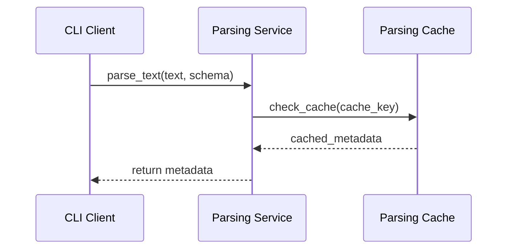
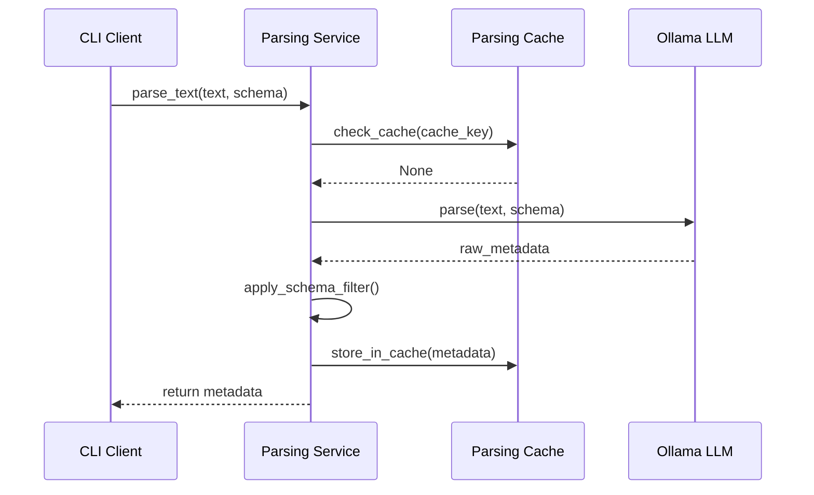
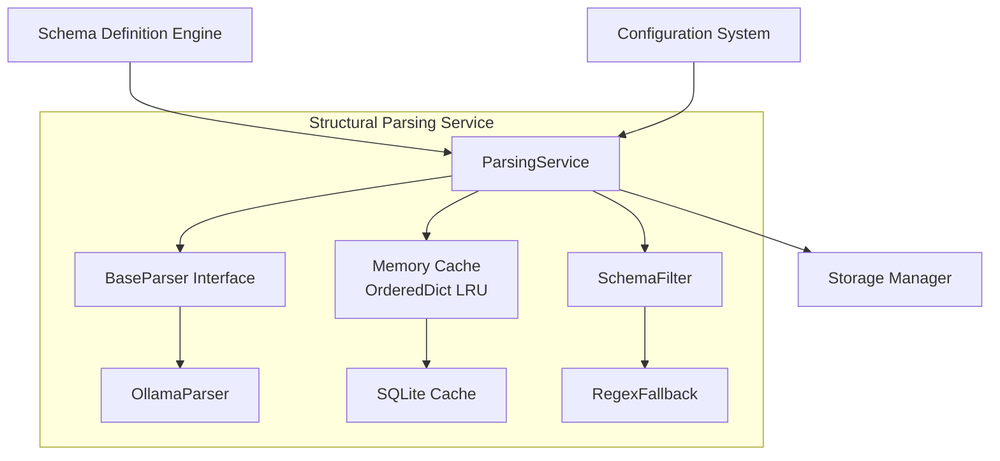

# Structural Parsing Service - Low Level Design
*Version: 1.2*  
*Date: 2025-07-15*  
*Status: Draft for Review*

## 1. Purpose and Scope
### Purpose
The Structural Parsing Service extracts metadata (e.g., domain, timestamp, entities) from unstructured text using a Large Language Model (LLM) to enable Globule’s semantic filesystem. It supports:
- **Semantic Path Generation**: Creates paths like `/valet/2025-07/task_123.json`.
- **Hybrid Search**: Provides metadata for keyword and semantic search.

### Service Guarantees
- **Performance**:
  - Cache hit: <500ms.
  - LLM parsing: <1.5s (local Ollama).
  - Regex fallback: <500ms.
  - Cache hit rate: >80%.
- **Reliability**: 100% local processing, regex fallback for robustness.
- **Quality**: >95% schema-compliant JSON, >80% entity extraction accuracy.

### MVP Scope
- **In Scope**: Ollama (`llama3.2:3b`), multi-tier caching (in-memory + SQLite), schema-driven filtering, core metadata (domain, timestamp, category, title, entities, keywords).
- **Out of Scope**: Cloud providers, nested entities, batch parsing, confidence scoring.

## 2. Component Overview
### Dependencies
- **Schema Definition Engine**: Supplies parsing schemas.
- **Configuration System**: Provides LLM and cache settings.
- **Storage Manager**: Stores metadata for path generation.

### Sequence Diagram (Cache Hit)


### Sequence Diagram (Cache Miss)


### Component Diagram


## 3. Interface Specification
### Public Method
```python
async def parse_text(text: str, schema: dict) -> dict
  # Input:
  # - text: Raw input (str, max 4096 chars)
  # - schema: Dict with entity_types (list), custom_rules (dict), required_fields (list)
  #   Example: {"entity_types": ["person", "date"], "custom_rules": {"phone": r"\d{3}-\d{3}-\d{4}"}, "required_fields": ["domain"]}
  # Output: Metadata dict
  #   Example: {"domain": "valet", "timestamp": "2025-07-15T09:00:00Z", "category": "task", "title": "Tesla Maintenance", "entities": [{"type": "vehicle", "value": "Tesla"}], "keywords": ["maintenance"]}
  # Behavior:
  # - Check cache for metadata
  # - On miss: Parse via LLM, filter with schema, cache result
  # - On failure: Use regex fallback, return partial metadata
  # Raises: ParsingError if required fields cannot be extracted
```

### Behavioral Contract
- **Cache Hit**: Retrieve metadata in <500ms.
- **Cache Miss**: Parse with LLM (<1.5s), validate, cache, return.
- **Failure**: Log error, extract required fields via regex, return defaults (e.g., `domain: "general"`, `category: "note"`).

## 4. Internal Design
### 4.1 Parsing Strategy (BaseParser)
- **Rationale**: Strategy pattern ensures extensibility for new LLM providers.
- **Interface**:
  ```python
  Function: parse(text: str, schema: Dict) -> Dict
    # Build prompt with schema and few-shot examples
    # Call LLM asynchronously
    # Validate JSON output, clean artifacts
    # Return raw metadata dict
  Function: build_prompt(text: str, schema: Dict) -> str
    # Format schema’s entity_types and custom_rules
    # Include few-shot examples if provided
    # Return JSON-compatible prompt
  ```
- **OllamaParser**:
  ```python
  Function: parse(text: str, schema: Dict) -> Dict
    # Use llama3.2:3b model, local endpoint
    # Generate prompt with low temperature (0.1)
    # Clean output (remove markdown, validate JSON)
    # Return raw metadata
  ```

### 4.2 Multi-Tier Cache (ParsingCache)
- **In-Memory**: OrderedDict LRU cache (100 entries, 24-hour TTL).
- **SQLite**: Table `parsing_cache(key TEXT PRIMARY KEY, metadata_json TEXT, created_at INTEGER, text_hash TEXT, schema_hash TEXT)`.
- **Cache Key**: SHA-256 of `normalized_text|schema_json|v1`.
- **Logic**:
  ```python
  Function: get(text: str, schema: Dict) -> Optional[Dict]
    # Normalize text (trim whitespace, lowercase)
    # Generate cache_key via SHA-256
    # Check memory cache, then SQLite
    # Return metadata if unexpired
  Function: set(text: str, schema: Dict, metadata: Dict)
    # Store in memory (evict oldest if full)
    # Persist to SQLite with timestamp and hashes
  ```

### 4.3 Schema Application
- **Schema Format**:
  ```python
  {
    "entity_types": ["person", "date"],
    "custom_rules": {"phone": r"\d{3}-\d{3}-\d{4}"},
    "required_fields": ["domain", "timestamp"],
    "few_shot_examples": [{"input": "Meet at 2pm", "output": {"timestamp": "2025-07-15T14:00:00Z"}}]
  }
  ```
- **Logic**:
  ```python
  Function: apply_filter(raw_metadata: Dict, schema: Dict, text: str) -> Dict
    # Filter entities to schema.entity_types
    # Apply custom_rules via regex
    # Ensure required_fields with RegexFallback
    # Validate with Pydantic MetadataOutput
  ```
- **Pydantic Model**:
  ```python
  class MetadataOutput(BaseModel):
      domain: str = "general"
      timestamp: Optional[str] = None
      category: str = "note"
      title: str = "Untitled"
      entities: List[Dict[str, str]] = []
      keywords: List[str] = []
  ```
- **Regex Fallback**:
  ```python
  Function: extract_field(field: str, text: str) -> Optional[str]
    # Patterns: timestamp (ISO 8601, 12-hour), domain (valet, work), task_id (TASK-\d{4})
    # Return match or default (e.g., current time for timestamp)
  ```

## 5. Design Decisions and Tradeoffs
- **SQLite vs. Redis**: SQLite for local-first, no dependencies. *Tradeoff*: Slower than Redis but simpler for MVP.
- **OrderedDict vs. cachetools**: Built-in, dependency-free. *Tradeoff*: Basic LRU, may need cachetools later.
- **Post-parsing Filtering**: Simplifies prompts but may miss nuanced extraction. *Future*: Schema-specific prompts.
- **Pydantic Validation**: Ensures robust output. *Tradeoff*: Slight overhead vs. manual validation.

## 6. Error Handling and Edge Cases
- **LLM Failure**:
  ```python
  Function: parse_with_fallback(text: str, schema: Dict) -> Dict
    # Try LLM parsing
    # On failure: Log error, use regex for required fields
    # Return partial metadata with defaults
  ```
- **Malformed Schema**: Log warning, use default schema (`{"entity_types": [], "required_fields": ["domain"]}`).
- **Cache Issues**: Bypass cache, proceed with parsing, log error.
- **Security Considerations**:
  - Sanitize inputs (remove null bytes, limit length).
  - Validate regex patterns to prevent ReDoS attacks.
  - Set SQLite file permissions (0600).
- **Edge Cases**:
  - Empty input: Return minimal metadata (e.g., `title: text[:50]`).
  - Oversized input: Truncate to 4096 chars, log warning.
  - Cache corruption: Skip corrupted entries, rebuild from source.

## 7. Extensibility and Substitutability
- **New Parser**: Implement `BaseParser` (e.g., `OpenAIParser`).
  ```python
  Function: parse(text: str, schema: Dict) -> Dict
  ```
- **Cache Backend**: Abstract via `CacheBackend` interface.
  ```python
  Function: get(key: str) -> Optional[Dict]
  Function: set(key: str, value: Dict, ttl: int)
  ```
- **Schema Evolution**: Add new entity types or rules via schema.

## 8. Testing Strategy
- **Unit Tests**:
  - Parser: Mock LLM, test prompt and output validation.
  - Cache: Verify hit/miss, LRU eviction, SQLite persistence.
  - SchemaFilter: Test entity filtering, regex fallback, Pydantic validation.
- **Integration Tests**: CLI → parser → cache → storage flow.
- **Performance Tests**: Verify <1.5s LLM parse, <500ms fallback, >80% cache hit rate.

## 9. Performance and Scaling
- **Optimizations**:
  - LLM: Low temperature (0.1) for consistency, minimal prompts.
  - Cache: 100-entry LRU, 24-hour TTL, monitor hit rate.
  - SQLite: Periodic `VACUUM` and `ANALYZE` for maintenance.
- **Scaling**:
  - Single-user MVP: ~10k cache entries sustainable.
  - Future: Batch parsing, Redis for multi-user scenarios.

## 10. Future Enhancements
- Batch parsing for multiple inputs.
- Few-shot prompt optimization.
- Confidence scoring for metadata.
- Cache metrics (hit rate, parse times) for debugging.
- Streaming parsing for long documents.